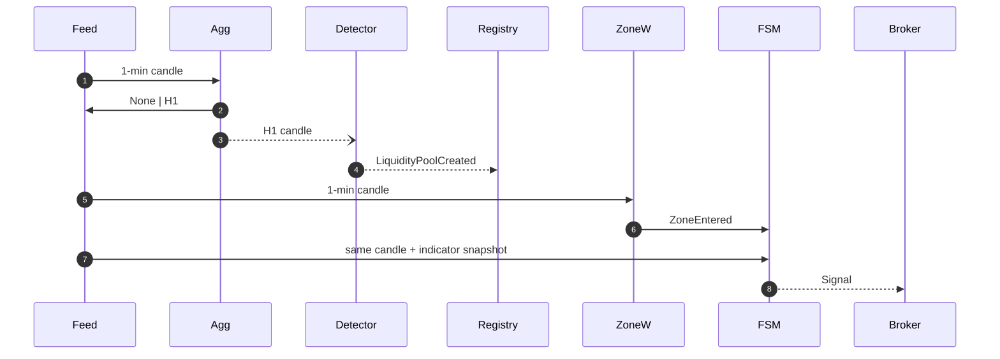

# Quant Algorithm Platform – Technical Blueprint

> **Audience:** Quant developers, ML engineers, DevOps, and any LLM agent that must interact with or extend the code‑base.

*Last updated: 25 Jul 2025*

---

## 1  Project Context

| Topic                   | Details                                                                                                                                                                                                                             |
| ----------------------- | ----------------------------------------------------------------------------------------------------------------------------------------------------------------------------------------------------------------------------------- |
| **Vision**              | Provide a *component‑oriented* engine capable of detecting **high‑time‑frame (HTF)** liquidity phenomena (Fair‑Value‑Gaps, HH/LL pivots, session highs / lows) and exploiting them with **low‑time‑frame (LTF)** precision entries. |
| **Motivation**          | ➊ Capture institutional liquidity footprints → better RR. ➋ Decouple research from execution so researchers can iterate on ideas without broker noise. ➌ Single code‑base for research ≤→ live.                                     |
| **Stakeholders**        | • Quant Research (AI/LLM)  • Execution Ops  • Risk Mgmt  • DevOps                                                                                                                                                                   |
| **Non‑functional Reqs** | Scalability • Decoupling • Parameterisation via YAML/Hydra • Tick or 1‑min granularity • No look‑ahead • Multi‑TF • 100 % deterministic back‑tests • Extensible to new feeds/brokers.                                               |

---

## 2  Technical Stack & Architecture

### 2.1 Layered Clean Architecture

```
            ┌───────────────────┐
            │ Presentation CLI  │  ← hydra/typer commands
            └────────┬──────────┘
                     │
            ┌────────▼──────────┐
            │ Application svc   │  ← orchestrators / runners
            └────────┬──────────┘
                     │  (Protocols)
            ┌────────▼──────────┐
            │     Core          │  ← entities, detectors, indicators, FSM
            └────────┬──────────┘
                     │  (Interfaces)
            ┌────────▼──────────┐
            │ Infrastructure    │  ← feeds, brokers, storage, alerting
            └───────────────────┘
```

*Core never imports infra.*

### 2.2 Languages & Libs

| Concern         | Lib / Tool                            | Notes                                 |
| --------------- | ------------------------------------- | ------------------------------------- |
| Core language   | **Python 3.12**                       | `match` pattern + perf.               |
| Async I/O       | `asyncio`, `aiohttp`, `websockets`    | Feeds / broker.                       |
| Data frames     | **polars**                            | ×5 faster than pandas.                |
| Config          | **Hydra** + Pydantic‑v2               | CLI sweeps.                           |
| Interval search | `intervaltree`                        | Overlap detection.                    |
| Speed‑ups       | `numba` on hot loops                  | opt‑in.                               |
| Tests           | `pytest`, `hypothesis`, `coverage.py` | 90 % target.                          |
| CI/CD           | GitHub Actions                        | lint, type‑check, unit, docker build. |

### 2.3 Runtime Services

| Service         | Tech                   | Purpose                              |
| --------------- | ---------------------- | ------------------------------------ |
| **Broker API**  | Binance, Alpaca, Paper | via pluggable `Broker` impl.         |
| **Storage**     | PostgreSQL             | trades, metrics, configs.            |
| Cache / Pub‑Sub | Redis                  | price cache, task queue, WS fan‑out. |
| Observability   | Prometheus + Grafana   | latency, queue depth, PnL.           |
| Alerting        | Telegram bot           | signals + failures.                  |

---

## 3  Granular Component Design

| ID      | Module                  | Key Methods                   | State & Data                                   |                         |
| ------- | ----------------------- | ----------------------------- | ---------------------------------------------- | ----------------------- |
| **C‑1** | `Candle` entity         | immutable dataclass           | ts, o/h/l/c, vol                               |                         |
| **C‑2** | `IndicatorPack`         | `update(candle)` → snapshot   | EMA21, EMA50, ATR, vol SMA, market regime flag |                         |
| **D‑1** | `TimeAggregator`        | `update(bar)` → \`Candle      | None\`                                         | ring buffer of ≤ W bars |
| **D‑2** | `FVGDetector`           | `update(htf_candle)` → events | tracks 3‑bar windows, min gap = cfg.           |                         |
| **D‑3** | `PivotDetector`         | swing highs/lows              | look‑back N, threshold σ                       |                         |
| **R‑1** | `LiquidityPoolRegistry` | CRUD pools                    | hashmap + TTL wheel                            |                         |
| **O‑1** | `OverlapDetector`       | interval tree ops             | creates High‑Liquidity‑Zone (HLZ) entities     |                         |
| **Z‑1** | `ZoneWatcher`           | price ∈ interval?             | subscribes to pools & HLZ                      |                         |
| **S‑1** | `SignalCandidate` FSM   | `process(bar,snap)`           | states: WAIT\_EMA → FILTERS → READY → EXPIRED  |                         |
| **X‑1** | `RiskManager`           | `size(signal, acct)`          | per‑trade ATR or %R                            |                         |
| **B‑1** | `BrokerAdapter`         | `submit(order)`               | side, size, stop, tp                           |                         |

> **FSM Transition Table** (excerpt)
>
> | State     | Guard                                            | Next     | Action           |
> | --------- | ------------------------------------------------ | -------- | ---------------- |
> | WAIT\_EMA | `bar.close>snap.ema21 & dt≤2 h`                  | FILTERS  | —                |
> | FILTERS   | `ema21<ema50 & vol OK & killzone OK & regime OK` | READY    | emit `Signal`    |
> | READY     | —                                                | terminal | —                |
> | *any*     | `now≥expiry`                                     | EXPIRED  | cancel candidate |

---

## 4  Deep Workflow Description

### 4.1 Back‑test Timeline

1. **Load** CSV of 1‑min candles with `CsvReplayFeed`.
2. For each bar ‑> **event bus** queue.
3. `IndicatorPack.update()` (LTF) → snapshot.
4. `TimeAggregator` collects → every 60 bars outputs **H1**; nested agg builds H4 & D1.
5. Detectors run on **closed HTF** candles.
6. Pool / HLZ events update registries.
7. `ZoneWatcher` sees price touch interval → spawns **SignalCandidate**.
8. Candidate FSM runs *immediately* on same bar with snapshot.
9. If FSM → READY → `Signal` → `RiskManager` size → `BrokerAdapter`.
10. Trade life‑cycle events recorded; metrics updated.

Sequence Diagram (Mermaid)



### 4.2 Live Mode

*Same sequence* but Feed consumes Binance websocket. Latency budget:

| Path                 | Target   |
| -------------------- | -------- |
| WS → event bus       | < 100 ms |
| Aggregation + detect | < 20 ms  |
| FSM + broker REST    | < 100 ms |

---

## 5  Testing Strategy

| Tier            | Scenario                       | Tooling                          |
| --------------- | ------------------------------ | -------------------------------- |
| **Unit**        | Indicator incremental = batch  | `hypothesis` property tests      |
|                 | FVG gap detection              | hand‑crafted candle fixtures     |
| **Integration** | Aggregator + detectors chain   | pytest + CSV slice               |
|                 | Overlap & HLZ life‑cycle       | synthetic events & interval tree |
| **System**      | Full back‑test vs baseline PnL | CLI run in GitHub Action         |
| **Acceptance**  | Live paper trade for 1 week    | smoke monitors on Prometheus     |

Synthetic data generator lives in `tests/factories.py` for speed.

---

## 6  Development Guidelines

1. **Branching:** trunk‑based + feature branches. PR ≤ 500 LOC.
2. **Commits:** Conventional commits (`feat:`, `fix:`, `test:` …).
3. **Type Safety:** mypy strict‑optional; no `Any` in core.
4. **Formatting:** Ruff/Black enforced pre‑commit.
5. **Docs:** Each public Protocol/class gets Google‑style docstrings + link to this notebook section.
6. **LLM integration:**
   • Provide *fully‑qualified* module hints when asking an LLM to modify code.
   • Never let an LLM write infra secrets; use dotenv placeholders.

---

## 7  Implementation Road‑Map (12 weeks)

| Phase                            | Duration | Deliverables                      | Dependencies |
| -------------------------------- | -------- | --------------------------------- | ------------ |
| **0** Project Bootstrap          | 0.5 wk   | repo, CI, code‑style, basic tests | —            |
| **1** Core Entities & Indicators | 1 wk     | `Candle`, EMA21/50, vol, regime   | Phase 0      |
| **2** TimeAggregator             | 1 wk     | multi‑TF roll‑up + tests          | 1            |
| **3** HTF Detectors              | 1.5 wk   | FVG & Pivot detectors             | 2            |
| **4** Pool Registry              | 0.5 wk   | CRUD + TTL wheel                  | 3            |
| **5** OverlapDetector & HLZ      | 1 wk     | interval tree, HLZ events         | 4            |
| **6** ZoneWatcher + FSM          | 1.5 wk   | Candidate state‑machine, filters  | 5            |
| **7** Risk & Broker Adapters     | 1 wk     | Paper broker, ATR sizing          | 6            |
| **8** Back‑test CLI              | 1 wk     | Hydra‑driven runner, CSV output   | 7            |
| **9** Live Paper Trading         | 1 wk     | Binance Testnet WS + REST         | 8            |
| **10** Observability & Alerts    | 0.5 wk   | Prom counters, Telegram bot       | 9            |
| **11** Prod Live Trading         | 1 wk     | key rotation, fail‑over, docs     | 10           |

> **Stretch goals:** ML‑driven regime classifier, Genetic hyper‑opt, GPU back‑tests with cuDF.

---

## 8  Glossary

* **Liquidity Pool (LP):** Price area where resting orders likely reside.
* **HLZ:** High‑Liquidity Zone = intersection of ≥2 LPs from distinct TFs.
* **Kill‑zone:** Preferred NY/LDN session window. Configurable.
* **TTL wheel:** O(1) timer wheel for pool/candidate expiry.
* **Snapshot:** Frozen indicator values computed *before* decision logic.

---

## 9  Initial Implementation Sprint Plan

Below is a step‑by‑step checklist translating Phases 1 → 5 of the roadmap into concrete coding tasks. Follow it sequentially—each row becomes a pull‑request that yields visible progress and executable code.

| Order | Road‑map Phase                     | Deliverable (code folder)                                                                      | Rationale                                                        | Acceptance test                                                                |
| ----- | ---------------------------------- | ---------------------------------------------------------------------------------------------- | ---------------------------------------------------------------- | ------------------------------------------------------------------------------ |
| **1** | **1 – Core Entities & Indicators** | Complete `core/indicators` • EMA 50, ATR 14, Volume SMA • `IndicatorPack.snapshot()`           | Everything downstream needs reliable **incremental** indicators. | `pytest` property test: incremental EMA == pandas\_ta EMA on prefix slices.    |
| **2** | **2 – TimeAggregator**             | Implement `core/strategy/aggregator.py` • Roll‑up 1 m → H1/H4/D1 • Emits *closed* candles only | Guarantees multi‑TF sync; prevents look‑ahead.                   | Feed 121 bars → assert 2 H1 candles, correct OHLCV sums.                       |
| **3** | **3 – HTF Detectors**              | Flesh out `core/detectors/fvg.py`; add `pivot.py`                                              | Unlocks `LiquidityPoolCreated` events.                           | Synthetic candles → expect bullish & bearish events exactly where hand‑marked. |
| **4** | **4 – LiquidityPoolRegistry**      | Build `core/strategy/pool_registry.py` • CRUD + TTL wheel                                      | Single source of truth for ZoneWatcher.                          | Create pools with 1‑sec TTL → advance fake clock → expiry events emitted.      |
| **5** | **5 – OverlapDetector & HLZ**      | Implement `core/strategy/overlap.py` (interval‑tree)                                           | Enables confluence strength filtering.                           | 3 pools (H1 & H4 overlap) → expect HLZ strength = Σ weights.                   |
| **6** | **Wire into Back‑tester**          | Extend `services/backtester.py` loop to integrate new modules; print pool/HLZ events           | Produces runnable script that shows results on real data.        | Run on sample CSV → events appear with correct timestamps.                     |

> **Tip:** Create tiny fixtures (`tests/data/mini/`) for lightning‑fast unit tests (<200 ms). Capture configs in `configs/base.yaml` so threshold tweaks never touch code.

---

## 10  Phase 8 — Back‑test, Walk‑Forward & Sweep

> **Scope**: Wire the full strategy stack into the CLI runner, enable deterministic back‑tests, walk‑forward evaluation, and grid‑search sweeps.

| Order | Deliverable                                       | Key Tasks                                                                               | Acceptance Test                                           |
| ----- | ------------------------------------------------- | --------------------------------------------------------------------------------------- | --------------------------------------------------------- |
| **1** | **Strategy Factory** (`core/strategy/factory.py`) | Build all Phase 1‑7 components (Indicators → Broker) from one config.                   | Feed 10 synthetic bars; expect exactly 1 `TradingSignal`. |
| **2** | **Broker plug‑in**                                | Pipe READY signals → `RiskManager.size()` → `PaperBroker.submit()`; write `trades.csv`. | Trade‑log SHA‑256 identical on two seeded runs.           |
| **3** | **Metrics collector**                             | Add Sharpe, Max‑DD, Win‑rate, latency. Dump `summary.json`.                             | Values match Excel reference in fixture.                  |
| **4** | **Walk‑Forward runner**                           | CLI flags `--folds`, `--train-fraction`; rebuild strategy per fold.                     | 4‑fold test outputs 4 rows + aggregate row.               |
| **5** | **Hyper‑parameter sweep** (`multirun`)            | Hydra overrides spawn parallel runs, write `results.csv` sorted by Sharpe.              | 3‑run sweep completes and leaderboard sorted.             |
| **6** | *(stretch)* Equity‑curve plot                     | `--plot` calls `python_user_visible` in ChatGPT sessions.                               | Visual curve renders.                                     |

### Config keys

```yaml
strategy:
  walk_forward:
    folds: 6
    train_fraction: 0.5
sweep:
  risk.risk_per_trade: [0.0025, 0.005, 0.01]
  candidate.expiry_minutes: [60, 120]
```

### Performance target

*1‑year BTC‑USD, 1‑min candles → full strategy loop finishes in < 15 s on laptop.*

---

### End of Blueprint

> For questions, open a GitHub Discussion or tag `@quant‑lead` in Slack.
